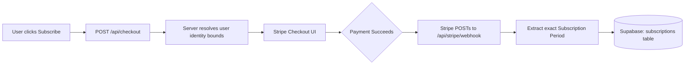

# WorLine Architecture Map

If you need to understand *how* the application routes data securely, this document maps the boundary flows between Server, Client, and external APIs (Supabase/Stripe). 

## 1. Request / Auth Flow
Every single page load evaluates identity securely before rendering any React layout natively.

```mermaid
graph TD
    A[Browser Request] --> B{middleware.ts}
    B -- Missing Env? --> C[/misconfigured]
    B -- Logged In? --> D[Attach Supabase Anon Session]
    B -- Logged Out & hits /app? --> E[/login]
    D --> F[src/app/app/layout.tsx]
    F --> G[Dashboard / Protected Routes]
```

## 2. Admin Protection Flow
Admin pages double-check the server session against physical hardcoded environment lists to stop forced access natively.

```text
User hits /admin -> `admin/layout.tsx`
 ↳ Checks `supabase.auth.getUser()`
 ↳ Extracts `.email`
 ↳ Compares against `process.env.ADMIN_EMAILS`
    [Match] -> Renders Dashboard
    [Fail]  -> Redirects to `/app`
```

## 3. Billing & Stripe Flow
Payments are never trusted from the client. The server generates Session URLs and Webhooks securely persist the truth.



## 4. Editor / Save / Export Flow
The drawing engine is highly client-side dependent (Zustand + Konva) until explicit API `Save` commands fire natively.

```text
`src/components/editor/EditorWorkspace.tsx`
 ↳ Bootstraps `react-konva` <Stage>
 ↳ Stores Shapes/Polygons in localized Zustand store
 
[Save Button Clicked]
 ↳ Zustand data stringified to massive JSON object
 ↳ Pushed to Supabase `projects` row `canvas_data`
 
[Export PDF]
 ↳ Client-side `pdf-lib` constructs raw binary stream from Canvas dataURL!
```

## 5. Testing & Seed Data Flow
CI drops must dynamically map user logic without risking locking staging environments natively or hitting Stripe blocks.

```text
Playwright hits UI 
 ↳ `tests/e2e/helpers/seed.ts` bypasses external Auth UIs
 ↳ Injects `PLAYWRIGHT_TEST_USER_EMAIL` straight to Supabase local container bindings
 ↳ Exits test logic exactly at Stripe boundary (does not enter Credit Card natively).
```

## 6. Release & Rollout Flow
Refer directly to the `docs/releases/` folder to trace exact operations milestones across branches securely cleanly.
